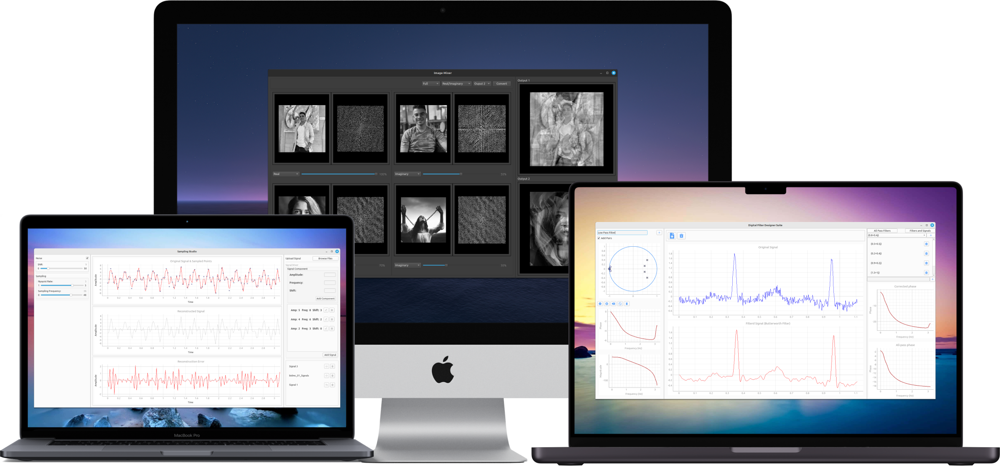
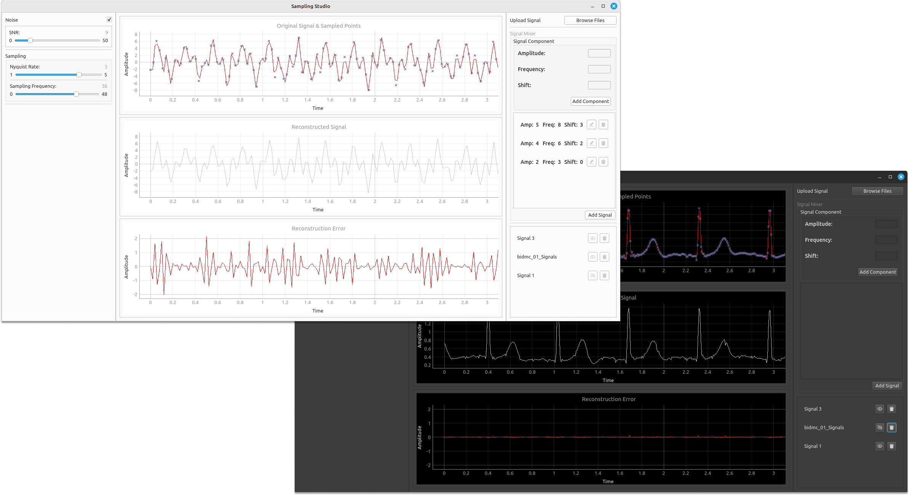
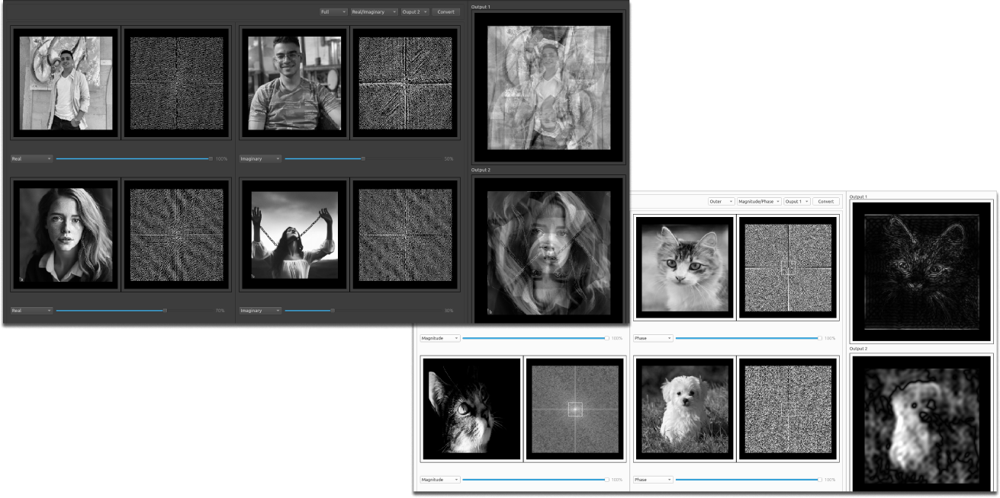
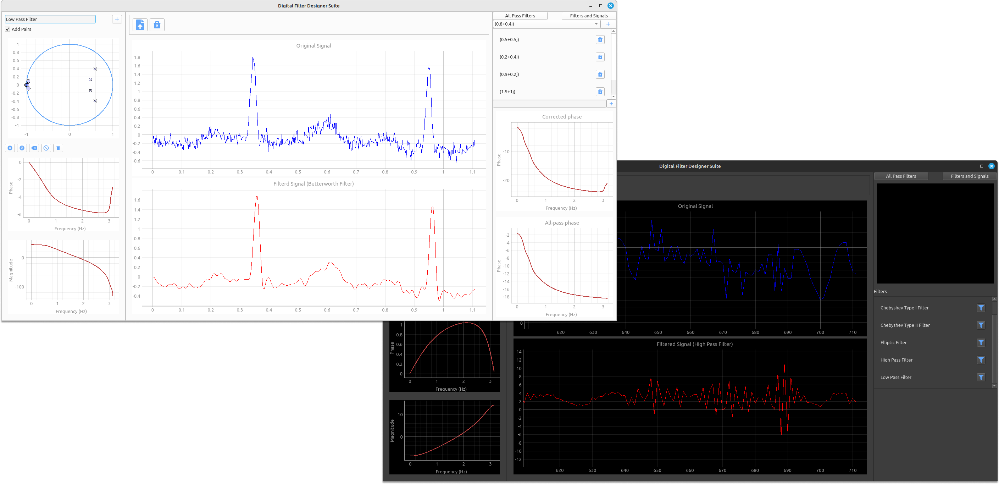

# Digital Signal Processing Tools

Welcome to the Digital Signal Processing Tools repository! This collection consists of three PyQt-based projects tailored for digital signal processing tasks.

  

## Table of Contents

- [1. Sampling Studio](#1-sampling-studio)
- [2. Image Mixer](#2-image-mixer)
- [3. Digital Filter Designer Suite](#3-digital-filter-designer-suite)
- [4. Contributors](#4-contributors)

## 1. Sampling Studio

Sampling Studio is a desktop application designed for working with biomedical signals. It allows users to open biomedical signal files, visualize them, sample them at a chosen frequency, and even add noise to the signals. Additionally, the built-in signal composer enables users to create custom signals with specific components.

  

**Features:**

- Open biomedical signals for visualization and processing.
- Adjust sampling frequency using intuitive sliders.
- Signal composer to create custom signals.
- Add controlled noise for testing and analysis.

**Getting Started:**

- Prerequisites: Python 3.6 or higher, PyQt6.
- Installation: Clone the repository and install required dependencies.
- Usage: Run the application and follow the provided instructions.

## 2. Image Mixer

Image Mixer is a desktop program designed to illustrate the significance of magnitude and phase components in 2D signals, particularly images. Users can load images, visualize their components, control brightness and contrast in real-time, and create new images by mixing phase/magnitude or real/imaginary components.

  

**Features:**

- Load and visualize images.
- Visualize image components: Magnitude, Phase, Real, Imaginary.
- Real-time brightness and contrast control.
- Image mixer to create new images with intuitive sliders.
- Regions mixer for precise mixing.

**Getting Started:**

- Prerequisites: Python 3.6 or higher, PyQt6.
- Installation: Clone the repository and install required dependencies.
- Usage: Run the application and follow the provided instructions.

## 3. Digital Filter Designer Suite

Digital Filter Designer Suite is a powerful application for designing digital filters with precision. Users can design filters directly on the unit circle, visualize phase and magnitude responses, and manipulate filters by adding poles and zeros. The suite also supports different all-pass filters and allows users to upload signals for visualization.

  

**Features:**

- Interactive unit circle design for precise filter design.
- Pole and zero manipulation with visualizations.
- All-pass filters for correcting phase-related characteristics.
- Signal visualization to understand filter impact.

**Getting Started:**

- Prerequisites: Python 3.6 or higher, PyQt6.
- Installation: Clone the repository and install required dependencies.
- Usage: Run the application and follow the provided instructions.

## 4. Contributors

A big thank you to all the contributors who made these projects possible!

<table>
  <tr>
    <td align="center">
    <a href="https://github.com/Bodykudo" target="_black">
    
     
    <b>Abdallah Magdy</b></a>
    <td align="center">
    <a href="https://github.com/abduelrahmanemad" target="_black">
    
     
    <b>Abdelrahman Emad</b></a>
    </td>
    </td>
    <td align="center">
    <a href="https://github.com/MohamedAlaaAli" target="_black">
    
     
    <b>Mohamed Alaa</b></a>
    </td>
    <td align="center">
   <td align="">
    <a href="https://github.com/Medo072" target="_black">
    
     
    <b>Mohamed Ibrahim</b></a>
    </td>
    </tr>
 </table>
 
 ---
